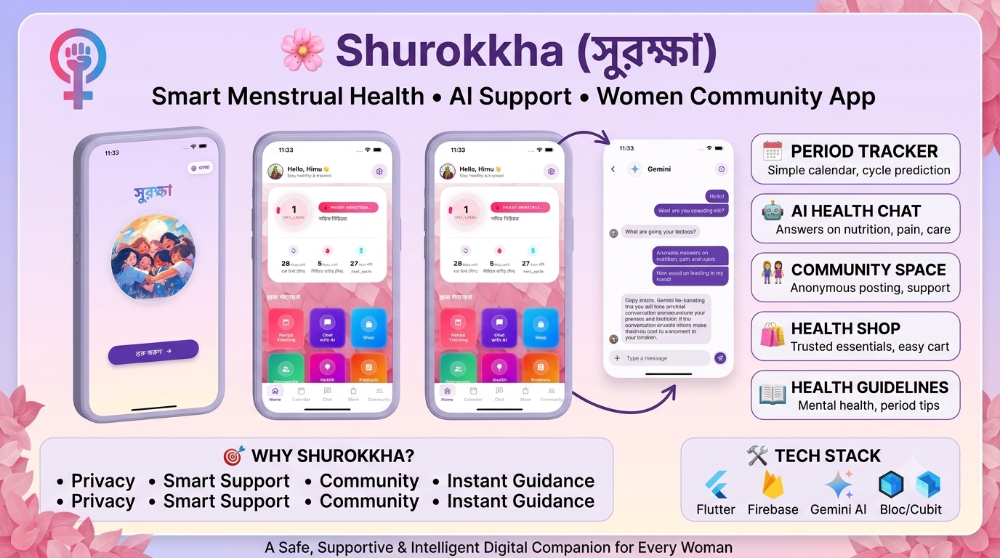

<h1 align="center">🌸 Shurokkha – Smart Menstrual Health Companion</h1>

<p align="center">
  <b>Smart Menstrual Health • AI Support • Women Community • Safe Digital Care</b>
</p>

<p align="center">
  A modern, privacy-focused women’s health application that combines <br>
  <b>cycle tracking, AI health assistance, community support, and wellness guidance</b> <br>
  into one intelligent platform.
</p>

<p align="center">
  
</p>


##  About Shurokkha

**Shurokkha (সুরক্ষা)** is a smart and safe digital health companion designed to support women in understanding and managing their menstrual health with confidence, privacy, and care.

It removes stigma around women’s health by providing a **secure, friendly, and intelligent space** where users can:
* 📅 **Smart Cycle Tracking:** Track menstrual cycles easily and accurately.
* 🤖 **AI Assistant:** Ask health-related questions using an intelligent chat system.
* 👭 **Safe Spaces:** Join an encrypted and supportive female community.
* 🛍️ **Wellness Shop:** Access essential, trusted hygiene products.
* 📖 **Curated Insights:** Learn medical-backed health, nutrition, and wellness tips.


##  Key Features

### 📅 Smart Period Tracker
* **Predictive Diagnostics:** Automated prediction for next cycle dates.
* **Fertility Windows:** Accurately track ovulation windows and safe days.
* **Minimalist Calendar Interface:** A clean, stress-free overview of your monthly timeline.
* **Personalized Health Insights:** Dynamically changes hints based on user phase.

### 🤖 AI Health Assistant
* **Instant 24/7 Response:** Immediate, confidential answers to health questions anytime.
* **Empathetic Explanations:** Non-judgmental language explaining pain management, nutrition, and symptoms.
* **Gemini Powered:** High-accuracy contextual guidance built directly into the UI chat interface.

### 👭 Safe Community Space
* **Pseudonymous Posting:** Share experiences and ask vulnerable questions with total peace of mind.
* **Moderated Space:** Zero tolerance for cyberbullying—designed to offer only supportive comments.
* **Group Dynamics:** Safe interactions where females can securely share daily wellness stories.

### 🛍️ Health & Wellness Shop
* **Curated Essentials:** Trusted menstrual hygiene and wellness items available instantly.
* **Secure Flow Checkout:** Simple operational cart flow for quick and hassle-free ordering.

### 📖 Health Guidelines
* **Education First:** Period care awareness modules breaking down myths.
* **Mental Health Support:** Mindfulness and lifestyle balancing recommendations.


## 🎯 Why Shurokkha?

Many women struggle silently due to a lack of awareness, hesitation, or stigma around menstrual health. **Shurokkha solves this by:**

| Feature | The Old Way | The Shurokkha Way |
| :--- | :--- | :--- |
| **Privacy** | Hesitation to talk or purchase items openly | Fully secured, private, and stigma-free |
| **Guidance** | Misleading internet searches | Smart, instant AI-backed medical literacy |
| **Community** | Isolating experiences | Safe, anonymous supportive sisterhood |


## 🛠️ Tech Stack

* 📱 **Flutter** — High-performance cross-platform mobile architecture
* 🔥 **Firebase** — Real-time database, robust security, and cloud authentication
* 🤖 **Gemini AI / LLM API** — Intelligent, responsive chat companion engine
* ⚙️ **Bloc / Cubit** — Clean enterprise-grade state management system


## 🚀 Getting Started

Follow these instructions to spin up a local development copy of Shurokkha:

```bash
# Clone the repository
git clone [https://github.com/touhidhimuiux/shurokkha.git](https://github.com/touhidhimuiux/shurokkha.git)

# Navigate to the project directory
cd shurokkha

# Fetch dependencies
flutter pub get

# Run the mobile application
flutter run
